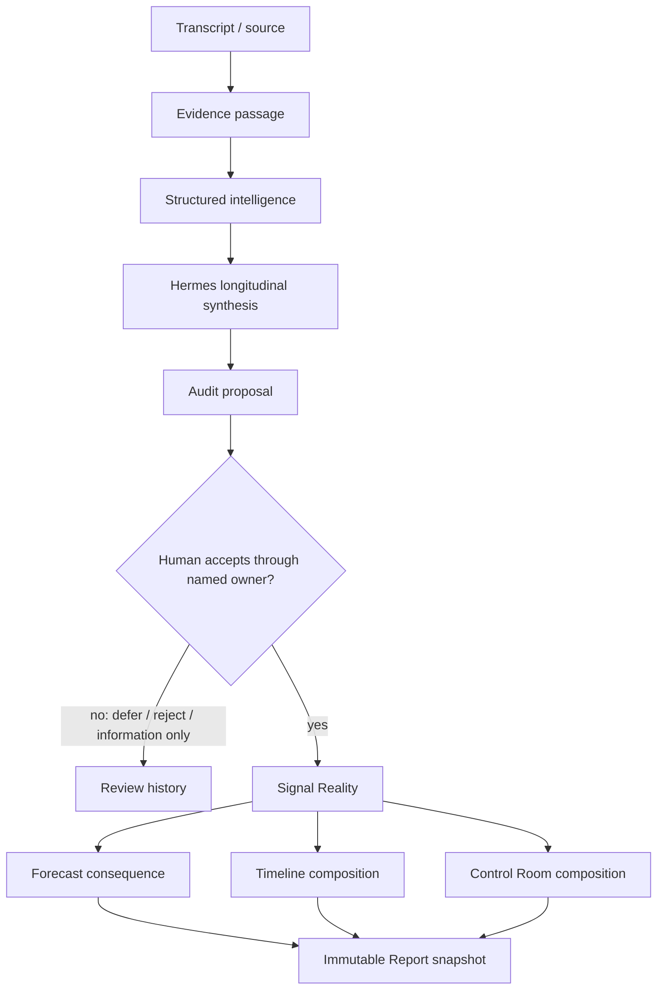

# Architecture for Humans

This is an authority map, not a code diagram.

## Why each boundary exists

- **A wiki is derivative synthesis.** It is excellent context, but a summary of three sources is not automatically a fourth independent source.
- **Evidence is not Reality.** A quote can prove what was said without proving what the delivery model should accept.
- **Hermes reasons; it does not govern.** It can connect time, detect contradiction, and propose artifacts while preserving human authority.
- **Audit proposes.** It compares current intelligence with Reality and packages a change with evidence, currentness, relevance, and owner.
- **Owner instruments govern.** Product shape, choices, precedence, people, and time require different validations and therefore different write paths.
- **Forecast calculates.** Once inputs are governed, the model updates automatically. A refusal or coverage caveat is part of the result.
- **Reports freeze.** The report preserves what was said at a moment, including sources and caveats; live Reality may later move.

The printable annotated asset is `screenshots/annotated/02-human-architecture.svg`.

