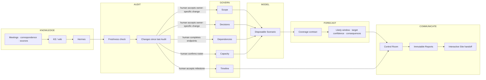

# Signal at a Glance

Signal turns knowledge into governed delivery truth, then turns that truth into consequences and communication.

## Read the arrows

- Knowledge is upstream context, not Reality.
- Audit discovers disagreement and proposes; it does not own product shape, choices, topology, people, or time.
- The governance boundary is the only place new canonical truth enters.
- Scenario is cheap and reversible. Reality is deliberate.
- Forecast is automatic but only as strong as its coverage contract.
- Control Room owns no facts. Reports freeze a point-in-time story. Site handoff is explicit and user-mediated.

The printable annotated asset is `screenshots/annotated/00-signal-at-a-glance.svg`.

