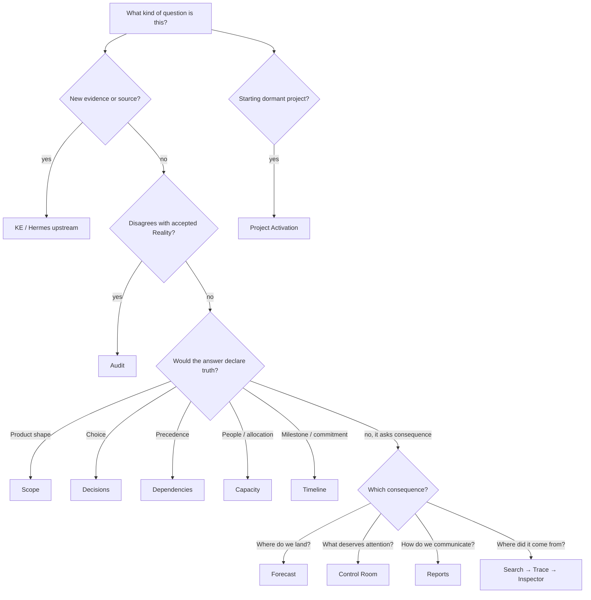

# Which Instrument?

Use the owner test: **if the action makes a claim canonical, use the owner instrument.** Audit proposes, Scenario explores, Forecast calculates, Reports communicate.

The printable annotated asset is `screenshots/annotated/01-which-instrument.svg`.

